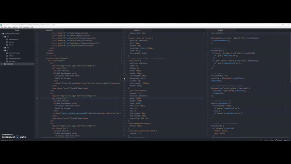

# Profile Website - Portfolio

 

## Description
This profile website briefly depicts me (Jason Choi) using HTML5, CSS, JavaScript, jQuery, and Scrolla.js  
This website is responsive so that viewers can clearly see the contents that depict who I am even though they resize the window.  
Welcome to my website and hope all of you enjoy it! 
 
**[Visit Website](https://jasonchoi.ga/)**

## Installation
1. Download the clone from this repository
2. Unzip the file
3. Open your code editor (Recommend using either Atom or Visual Studio Code)
4. Open the project folder
5. If using Atom, go to 'Package' and run 'atom-live-server'

## Tech/Framework used
**HTML**: HyperText Markup Language. It defines the meaning and structure of web content.
 - URL: hhttps://developer.mozilla.org/en-US/docs/Web/HTML  

**CSS**: Cascading Style Sheets. It describes how elements should be rendered on screen, on paper, in speech, or on other media.
 - URL: https://developer.mozilla.org/en-US/docs/Web/CSS  

**JavaScript**: A lightweight, interpreted, or just-in-time compiled programming language with first-class functions.
 - URL: https://developer.mozilla.org/en-US/docs/Web/JavaScript  

**jQuery**: A JavaScript Library that focuses on simplifying DOM manipulation, AJAX calls, and Event handling.
 - URL: https://developer.mozilla.org/en-US/docs/Glossary/jQuery  

**Scrolla.js**: A jQuery plugin for reveal animations when scrolling
 - URL: https://maximzhurkin.github.io/jquery-scrolla/  
 
## Features
- **Home**: A home page. Includes a logo, header title, menu bar, and visual slides
- **About**: Depicts who Jason is. Includes a summary of 'about me'
- **Projects**: Includes four main projects built with HTML, CSS, JS, React.js, Node.js, MongoDB, Python, and etc
- **Skills**: See what skills Jason knows
- **Experience**: Includes his work experience. Plus, a brief summary for each
- **Contact**: Includes email, social media, and copy right
 
